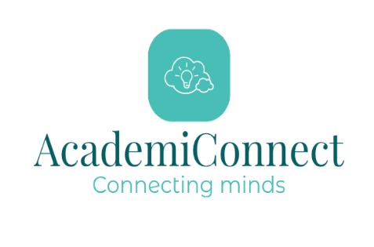

# Academi Connect 🎓

Academi Connect is a collaborative web application developed with Flask and Vue.js, designed to simplify the process of scheduling consultations between students and lecturers at Durban University of Technology. This platform aims to enhance communication and collaboration between students and faculty, making it easier for students to seek academic guidance and support.

## Features

- **User-friendly Interface**: Academic Connect provides an intuitive and easy-to-use interface for both students and lecturers.

- **Consultation Booking**: Students can view the availability of their lecturers and book consultation slots based on their schedules.

- **Profile Management**: Students and lecturers can manage their profiles, including personal information, availability, and consultation preferences.

- **Feedback System**: After a consultation, students can provide feedback on the session, enabling lecturers to improve and tailor their support.

## Demo 🚀

Check out the [demo](https://academicconnect.azurewebsites.net/) to explore Academic Connect.

